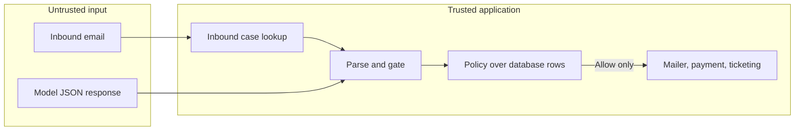
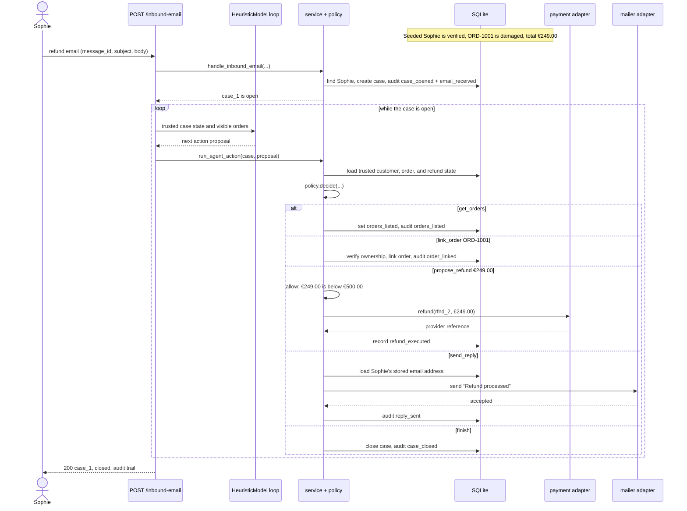

# SafeRefundAgent (`simple` branch)

An untrusted model proposes a typed JSON action; deterministic application code in `service.run_agent_action` validates it through `policy.decide` before any business effect runs. The model response never writes rows directly or chooses a refund recipient. It may propose an order id, but `policy.decide` permits linking only an id from the customer's trusted owned-order rows loaded by `service._policy_state_for`.

## Architecture at a glance



The model can propose one typed action. The gate loads trusted state, decides
deterministically, then either records a denial, parks a refund for approval,
closes the case through escalation, or performs the allowed effect.

> **Deliberate simplification contract.** This application is single-process,
> SQLite-only, and demonstration-grade. Mutable rows are authoritative. Audit events
> are informational. Concurrent operator actions, crash recovery, effect atomicity,
> PostgreSQL behaviour, and multi-worker execution are not guaranteed. The
> production-grade version of this project, with event sourcing and concurrency
> proofs, lives on the `main` branch.

## Quick start

**Prerequisites:** Python 3.13+ and [uv](https://docs.astral.sh/uv/).

```bash
make install    # uv sync
make demo       # reset SQLite, seed Sophie, run one inbound refund walkthrough
make run        # uvicorn saferefund.main:app --reload
make check      # ruff format/check, mypy, pytest
```

The demo uses an in-memory-style SQLite file (`config.DATABASE_URL`), resets it, freezes the clock, posts one inbound email for verified customer Sophie Dubois, and runs `agent.run_agent_loop` with `HeuristicModel`. No PostgreSQL, external worker service, or async handlers.

This branch will never merge into `main`; it exists so a reviewer can read every production file and every test in one sitting.

## Demo walkthrough

`make demo` runs a self-contained ASGI integration conversation. The script resets and seeds its SQLite database, then literally sends the request shown below to `POST /inbound-email`. The endpoint creates every event while it runs; the final list is the endpoint response, not an event fixture or a later database report.

It first states Sophie's relevant starting state (verified customer, damaged €249 order, no prior refund, and the €500 automatic-refund limit), then explains each actual event as a state transition. A reader can therefore follow the high-level flow without looking up the seed data or policy code.

```
Sophie -> POST /inbound-email
{
  "body": "My espresso machine arrived damaged.",
  "envelope_from": "sophie@example.com",
  "message_id": "msg-demo-sophie-refund",
  "subject": "Refund please"
}

Server -> Sophie
{
  "case_id": "case_1",
  "status": "closed"
}

Server wrote these events, in order:
  1. case_opened: {"message_id": "msg-demo-sophie-refund"}
  2. email_received: {"body": "My espresso machine arrived damaged.", ...}
  3. orders_listed: {}
  4. order_linked: {"order_id": "ORD-1001"}
  5. refund_executed: {"amount": "249.00", ...}
  6. reply_sent: {"body": "Your refund has been processed successfully.", ...}
  7. case_closed: {"outcome": "finished", "summary": "Case resolved."}
```

Reading the conversation:

- Row 1–2: `service.handle_inbound_email` opens case `case_1` for Sophie and audits inbound mail.
- Row 3–4: `HeuristicModel` proposes `get_orders` then `link_order` for `ORD-1001` (€249 damaged espresso machine); `policy.decide` allows both; `service._perform` mutates the case.
- Row 5: refund €249 is below `config.REFUND_APPROVAL_THRESHOLD` (€500), so `policy.decide` returns `Allow` and `service._perform` calls `adapters.payment.refund` inline — no operator queue.
- Row 6: reply goes to `customer.email` from the database, not from model text (`service._perform` → `adapters.mailer.send`).
- Row 7: `finish` closes the case with outcome `finished`; the `summary` audit detail is model-supplied text stored for readability only.
- Row 6 is one email to `sophie@example.com` — the only customer-facing email after payment succeeded.

Sophie’s order total (€249) is under `config.REFUND_APPROVAL_THRESHOLD` (€500), so the walkthrough never touches the operator approval queue (`service.list_pending_refunds`).

### Demo request sequence



## What is enforced

`policy.decide` evaluates these rules in order; `service.run_agent_action` applies the verdict before any effect:

| # | Rule id | Applies to | Condition | Verdict |
|---|---|---|---|---|
| 1 | `R_CASE_NOT_OPEN` | every action | `case_status` is not `open` | Deny |
| 2 | `R_DENIAL_LOOP` | every action | `consecutive_denials >= denial_loop_threshold` | Escalate |
| 3 | `R_UNVERIFIED` | `get_orders`, `link_order`, `propose_refund` | customer not verified | Deny |
| 4 | `R_ALREADY_VERIFIED` | `request_verification` | customer already verified | Deny |
| 5 | `R_NOT_OWNED` | `link_order` | `order_id` not in owned orders | Deny |
| 6 | `R_NO_LINKED_ORDER` | `propose_refund` | no linked order on case | Deny |
| 7 | `R_AMOUNT` | `propose_refund` | amount invalid (non-finite, ≤0, >2 decimals) | Deny |
| 8 | `R_OPEN_REFUND` | `propose_refund` | order has `pending_approval` refund | Deny |
| 9 | `R_REMAINDER` | `propose_refund` | amount exceeds refundable remainder | Deny |
| 10 | `R_THRESHOLD` | `propose_refund` | customer refunded + amount > approval threshold | RequireApproval |
| — | — | otherwise (exhaustive `match` + `assert_never`) | — | Allow |

`send_reply`, `escalate`, and `finish` are constrained only by rules 1–2. A new action type without a `match` arm fails `mypy` and `tests/test_policy_table.py`.

## What is not guaranteed

This branch is for thesis review, not production deployment. The detailed follow-up work is in [DEBT.md](DEBT.md).

- **Crash recovery and effect atomicity** — a crash between an adapter call and `session.commit` can lose the matching audit row while the effect already ran.
- **Single-process SQLite only** — the in-process money lock does not coordinate workers; PostgreSQL behaviour is unproven.
- **Audit is not replayable** — mutable rows, not audit events, are authoritative.
- **Gate is application code, not a sandbox** — the configured model client is trusted; its response is the untrusted input.

## Repository map (14 production files)

```
src/saferefund/
  __init__.py    package marker
  config.py      all tunables (thresholds, TTLs, limits, canned messages)
  clock.py       UTC now() with test override
  ids.py         deterministic counter ids for cases, refunds, tokens
  models.py      six SQLAlchemy tables and StrEnum status columns
  db.py          engine, SessionLocal, create_all, reset, seed fixture
  actions.py     seven typed Pydantic action models (extra=forbid)
  policy.py      PolicyState + policy.decide ordered rule chain
  adapters.py    in-memory mailer, payment, ticketing fakes
  service.py     the gate: load → decide → mutate → adapter → audit
  agent.py       prompt, parse_action, bounded run_agent_loop, model stubs
  api.py         five sync FastAPI endpoints
  demo.py        literal HTTP conversation and server-created event walkthrough
  main.py        FastAPI app factory and startup create_all
```

**Further reading:** [docs/ARCHITECTURE.md](docs/ARCHITECTURE.md) — normative design with enforcing citations; [DEBT.md](DEBT.md) — deliberately deferred work.
