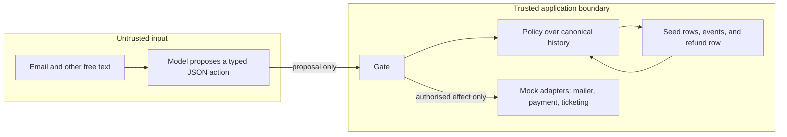
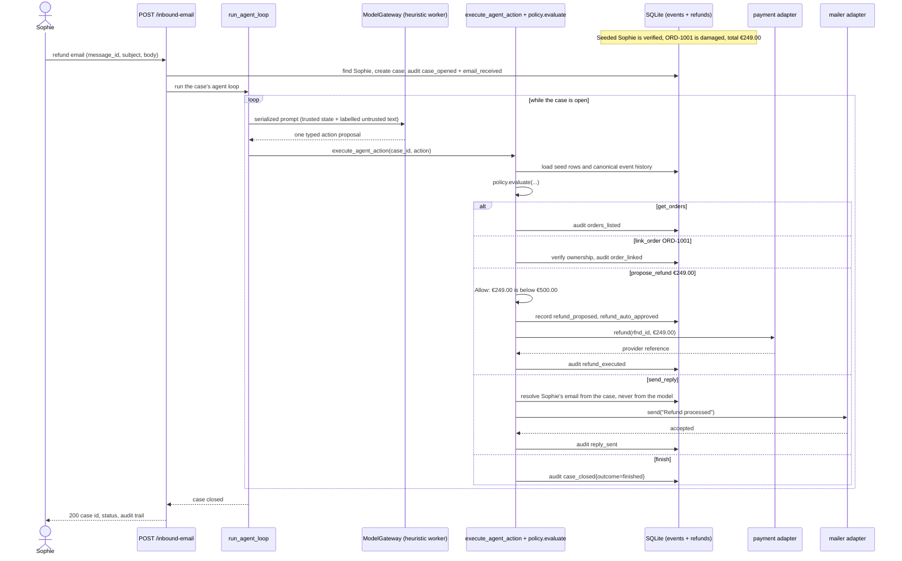

# SafeRefundAgent

[](https://deepwiki.com/ichorid/refundagent)

A deliberately small architecture exercise: an untrusted refund agent may propose typed actions, but a deterministic gate is the only component allowed to authorise and execute their effects.

> **New to this repository?** Read the [`simple`](../../tree/simple) branch first. It is a
> deliberately toy-grade rewrite that strips away every production-grade mechanism (event
> sourcing, PostgreSQL concurrency proofs, import-linter, process isolation) and keeps only the
> one thesis this project demonstrates: *an untrusted model proposes a typed action; deterministic
> application code validates it before performing an external effect.* It is recommended for
> human reviewers to read first, to see that core idea without the production hardening around
> it — `simple` is never merged into `main` and carries none of `main`'s guarantees; see its
> own README for the explicit list of what it deliberately does not attempt.

## Why this exists

This repository is about the enforcement boundary around an LLM, not about making an LLM trustworthy. It demonstrates two properties that prompt engineering alone cannot provide:

1. **Structural elimination** — dangerous capabilities are absent from the action schema. The model cannot pass a customer id, reply recipient, or refund order id because those fields do not exist on any action type.
2. **Path-dependent policy** — the same parsed action can be allowed, denied, suspended for approval, or force-escalated depending on folded history, verification state, and refund totals.

Prompt injection can steer what the model *says* or *proposes*. It cannot create capabilities absent from the action schema or turn a disallowed proposal into an effect. It can still influence permitted choices and reply content; those limits are deliberate and documented in [DEBT.md](DEBT.md).

## Quick start

**Prerequisites:** Python 3.13+ and [uv](https://docs.astral.sh/uv/).

```bash
uv sync
make demo
```

The demo resets a local SQLite database, seeds Sophie Dubois (`sophie@example.com`), posts one inbound email about a damaged espresso machine, runs the agent loop behind `ModelGateway`, and prints two tables.

**What to notice:**

- The event table shows a full audit trail: `case_opened` → `email_received` → agent steps → `refund_auto_approved` → `refund_executed` → `reply_sent` → `case_closed`.
- Sophie’s damaged espresso machine order (`ORD-1001`, €249) is below the €500 auto-approval threshold, so payment runs without operator involvement.
- The mailer outbox shows exactly one customer-facing reply after the refund is executed.
- Accepted internal state transitions are evented transactionally inside the gate; money movement is never inferred from model text alone.
- External effects (mail, ticketing) are effect-first with durable intent/evidence and an explicitly named crash window — there is no transactional outbox (`DEBT.md`).

## Architecture at a glance



The model never calls a tool. It produces one value from a small action union; the gate loads the relevant seed rows and canonical event history, evaluates deterministic policy, and then either records a refusal, suspends a refund for approval, closes the case through escalation, or performs the authorised effect.

Events are the audit trail and the source for case/customer/order projections. `refunds` is the deliberate exception: a mutable materialised row exists so the database can enforce “at most one live refund per order,” including against future code that forgets the policy rule.

`RequireApproval` is an accepting but non-paying outcome: the proposed refund is durably recorded as `pending_approval`, while payment is withheld until an operator acts. It is neither an `Allow` nor a soft denial.

### Demo request sequence

The `make demo` walkthrough (Sophie Dubois, `ORD-1001`, €249 damaged espresso machine) in terms of the modules that actually run it: `api/routes.py::post_inbound_email` creates the case directly (event appends outside the gate's seven mediated operations are not façade-routed, per `docs/ARCHITECTURE.md` §9), then hands off to `agent/loop.py::run_agent_loop`, which calls the trusted `ModelGateway` for each proposal and `gate/__init__.py::execute_agent_action` to decide and apply it.



## Invariants and guarantees

These are the claims a reviewer should use to read the implementation. The full normative definitions and tests are in [docs/ARCHITECTURE.md](docs/ARCHITECTURE.md).

| Invariant | Mechanism and resulting guarantee |
|---|---|
| **Authorisation uses trusted control state only** | Policy and projections read immutable seed rows plus validated canonical events. Free-text email, model output, names, item text, and reasons never decide ownership, amount, verification, approval, or lifecycle state. |
| **The model cannot express cross-principal effects** | Actions have no customer id, reply recipient, or refund order id. The inbound route resolves the customer; a reply recipient comes from the case; a refund targets the already validated linked order. |
| **Order disclosure requires an authorized `orders_listed` event** | Before a canonical `orders_listed` event exists, structured prompt state and memory expose no order IDs or seed details. After authorization, only IDs recorded by the latest `orders_listed` event are joined via `disclosed_order_ids`. |
| **History is auditable and scope-correct** | Events are append-only and sequenced per customer. Composite relational scope checks (`relational_scope.py`) and projections fold only their customer, case, or order slice, so another case cannot alter a case’s control state. |
| **Model path: trusted gateway, untrusted provider bytes** | Production uses `ModelGateway` and its transports (trusted Python). Only serialized provider response bytes are untrusted until `invoke_model_boundary` validates and parses them. Process isolation strips application packages from the worker; OS-level egress is deployment debt (`DEBT.md`). |
| **Inbound delivery is idempotent without cross-customer takeover** | A case is correlated by `(customer_id, opening_message_id)`. The same message for the same customer adds no event; the same sender-controlled message id for another customer opens a separate case. |
| **Policy is fail-closed and ordered** | Only the policy driver can yield `Allow`; an action type without explicit obligations is denied. Every denial or forced-escalation rule runs before `RequireApproval`, so suspension cannot hide a rule that should refuse. |
| **Refund bounds survive case boundaries; PostgreSQL 16.4 contention is tested** | Amount/remainder checks and the cumulative threshold read order history across cases. A customer lock serialises history read, policy evaluation, and event append; the database partial unique index independently permits only one live refund per order. Real contention evidence lives in `tests/postgres/` on PostgreSQL 16.4 only — SQLite functional tests do not prove deployment contention. |
| **Operator approval is one-shot and bound to proposal evidence** | Approval belongs to one `refund_id`. Immutable intent fields (`id`, `customer_id`, `order_id`, `case_id`, `amount`, `created_at`) are ORM-guarded; approval reloads canonical `refund_proposed` evidence via `validate_refund_intent_against_proposed_evidence` and pays only on byte-for-byte agreement. After expiry is applied, approve/reject uses a guarded `UPDATE ... WHERE status = 'pending_approval'`; exactly one competing decision can win, and a stale one returns `409`. |
| **Expiry has one exact boundary** | The approval window is `[created_at, approval_expires_at)`. At `approval_expires_at`, approval is already refused, the pending queue excludes the refund, and expiry changes it to `expired` when the customer is next reaped. |
| **Money has durable intent before payment** | The refund proposal and approval commit before the payment adapter is called, with `refund_id` as the payment idempotency key. A post-payment event records completion; reconciliation is still required after a crash. |
| **External effects are gate-mediated** | Only the gate invokes payment, mailer, and ticketing effects; normal effects require a single-use authorisation minted after `Allow`. `Deny` records no effect, `RequireApproval` records no payment, and escalation always writes `escalated` immediately followed by `case_closed`. |
| **Cases cannot loop forever on model failure** | Step count, invalid-output count, and wall-clock model timeout are hard limits. `invoke_model_boundary` owns gateway invocation, exact-runtime-string validation, and parsing; protocol violations escalate once with `model_failure` and close the case. Infrastructure errors intentionally propagate so operational failure is not disguised as a completed case. |
| **Verification is customer-wide, not case-local** | Successful verification writes a customer-scoped event and resumes all newly open cases. An expired verification request no longer leaves a case permanently suspended. |

The action menu and prompt provenance labels are usability aids, not security controls. The gate must reach the same result even if the model ignores both.

## What is intentionally not guaranteed

This is an architecture artifact, not a production-ready support system. Authentication, sender authenticity, reply-content governance, periodic expiry reaping, transactional mail/ticket delivery (effect-first adapters leave a named crash window), database-level append-only enforcement beyond ORM listeners, and PostgreSQL concurrency outside the tested PostgreSQL 16.4 disposable service are all outside its guarantees. See [DEBT.md](DEBT.md) for the rationale, failure modes, and next engineering steps.

## Evidence: observable scenarios

| Scenario | Test | What it proves |
|---|---|---|
| Small refund auto-approved | `test_happy_path_small_refund` | Below-threshold refund executes without operator |
| Large refund needs approval | `test_large_refund_requires_approval` | `RequireApproval` withholds payment |
| Operator rejection | `test_operator_rejection` | Reject resumes case without payment |
| Operator approve exact lifecycle | `test_operator_approve_response_matches_exact_effect_and_event_sequence` | HTTP approve asserts full event sequence, refund identity, and payment |
| Operator reject exact lifecycle | `test_operator_reject_response_matches_exact_no_payment_sequence` | HTTP reject asserts full sequence with zero payment |
| Approval does not carry over | `test_approval_does_not_carry_over` | One-shot approval per `refund_id` |
| Cumulative threshold | `test_cumulative_threshold` | `R_THRESHOLD` sums per order, not per case |
| Verification gate | `test_unverified_blocked_then_verified` | Unverified customer blocked until token confirm |
| Verification unblocks all cases | `test_verification_unblocks_all_cases` | Confirm resumes every open case, oldest first |
| Unverified order disclosure boundary | `test_unverified_model_cannot_read_or_exfiltrate_order_data` | No order fields before authorized `orders_listed` |
| Prompt injection in email | `test_prompt_injection_in_email` | Injected instructions cannot bypass policy |
| Second-order injection via item | `test_second_order_injection_changes_proposals_but_not_authorised_effects` | Injected item changes model proposals before the gate; authorised effects stay blocked |
| Denial loop escalation | `test_denial_loop_forces_escalation` | Exact termination sequence via `assert_terminal_escalation_closure` |
| Agent escalation closes case | `test_agent_escalation_closes_case` | Exact `escalated` + `case_closed` sequence and one ticket |
| Step limit | `test_step_limit` | Exact step-count termination sequence |
| Parse failure limit | `test_parse_failure_limit` | Exact invalid-output termination sequence |
| Model protocol failure | `test_non_string_model_output_escalates_and_closes_case` | `invoke_model_boundary` closes on type violations |
| Unknown sender | `test_unknown_sender` | `202`, canned reply, no case or events |
| Duplicate message id | `test_duplicate_message_id_is_idempotent` | No second `email_received` |
| Approval expiry | `test_approval_expires` | Exact expiry + resume sequence via `assert_case_expired_with_agent_resume` |
| Operator pending list | `test_operator_pending_returns_active_rows` | Active approvals listed; expired rows filtered |
| PostgreSQL threshold contention | `test_two_concurrent_300_refunds_cannot_both_auto_approve` (`tests/postgres/`) | Exactly one auto-approve under PostgreSQL 16.4 |

The suite also contains focused invariant tests for the trust boundary, policy coverage, expiry equality, DDL, one-shot approval, projection scoping, and causal injection evidence. The full catalogue is [docs/ARCHITECTURE.md](docs/ARCHITECTURE.md) §17.

## API and development commands

| Endpoint | Purpose |
|---|---|
| `POST /inbound-email` | Open or resume a case from inbound mail; runs agent loop when actionable |
| `GET /operator/pending` | List active `pending_approval` refunds (`approval_expires_at > now`) |
| `POST /operator/approve` | Approve one `pending_approval` refund by `refund_id` |
| `POST /operator/reject` | Reject one `pending_approval` refund by `refund_id` |
| `POST /verification/confirm` | Confirm customer with verification token |

| Command | Purpose |
|---|---|
| `make demo` | Run the Sophie refund walkthrough (`uv run python -m saferefund.demo`) |
| `make run` | Start FastAPI with reload (`uv run uvicorn saferefund.main:app --reload`) |
| `make check` | Ruff format/check, mypy, import contracts, and full pytest suite |

Inbound request bodies accept `envelope_from`, `message_id`, `subject`, and `body` only — not `actor` or `channel` (`test_request_schemas_reject_actor_and_channel_fields`).

## Repository map

```
src/saferefund/
  api/          HTTP routes and request/response schemas
  agent/        ModelGateway, invoke_model_boundary, prompt assembly, parsing, loop
  actions/      Typed action models (structural capability restrictions)
  gate/         Seven gate operations; sole importer of adapter side effects
  policy/       Ordered rule checks and verdict types
  projections/  Pure folds over scoped event slices
  repositories/ Seed data, relational_scope, refund_intent, event append protocol
  adapters/     Mock mailer, payment, and ticketing
  domain/       Tables, enums, event types, payloads
  bounds.py     Shared untrusted-input length and digest helpers
  demo.py       Canonical HTTP demo and table printer
worker/
  saferefund_model_worker/  Isolated subprocess model worker (prompt/response bytes only)
tests/
  postgres/     PostgreSQL 16.4 concurrency evidence
  support/      sequence_assertions.py and shared integration helpers
docs/
  ARCHITECTURE.md       Full specification (authoritative)
DEBT.md                 Honest engineering debt record
```

## Known limitations and next step

Core and Stretch are complete for this repository; the artifact is still not production-ready. The largest gaps:

- No authentication; operator identity is unauthenticated.
- Reply body content is not governed — only whether a reply may be sent.
- `GET /operator/pending` lists ids and amounts only — no case narrative for the operator.

**First improvement I would make with another day:** widen `R_THRESHOLD` to a per-customer rolling window (see [DEBT.md](DEBT.md) — the current per-order scope is too narrow).

**Further reading:**

- [docs/ARCHITECTURE.md](docs/ARCHITECTURE.md) — complete design
- [DEBT.md](DEBT.md) — domain and infrastructure debt in first person

No production LLM backend is included — `ModelGateway.heuristic_subprocess()` drives the demo and trusted gateway transports with scripted responses drive tests.
