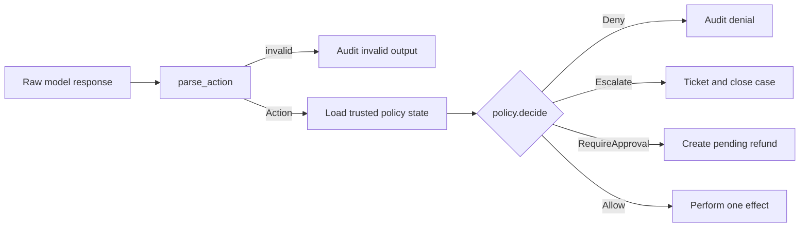

# Architecture (`simple` branch)

Normative design for the toy rewrite. Every enforcement claim names the file and function that implements it. Mutable SQLite rows are authoritative; `audit_events` is informational only.

## Trust model

1. **Untrusted:** model response text (`agent.parse_action`), email body/subject, order `item` seed text — truncated and labelled in `agent.build_prompt`, never read by `policy.decide`. The configured Python model client is trusted application code; only its response crosses the agent boundary.
2. **Trusted:** rows loaded by `service._policy_state_for` — `Customer.verified`, `Case` status and counters, `Order.total` / `refunded_total`, owned order ids from `select(Order.id)`.
3. **Structural:** action schema in `actions.py` — no customer id, reply recipient, or refund order id fields (`extra="forbid"` on each model). `link_order.order_id` is model-supplied, but rule `R_NOT_OWNED` constrains it to the trusted owned-order set.
4. **Gate:** only `service.py` invokes payment, mail, or ticketing effects; every parsed `Action` is evaluated by `service.run_agent_action` before it reaches those calls.
5. **Fail-closed:** `policy.decide` ends with exhaustive `match` + `assert_never`; an unlisted action type fails `mypy` and `tests/test_policy_table.py::test_every_action_type_has_an_allow_row`.

## Decision flow



Only the right-hand outcomes mutate business state or call an adapter. Raw text,
email content, and order item text never become a policy input.

## Data model (`models.py`)

Sync SQLAlchemy 2.0 declarative. Enum-like columns use `StrEnum` classes in the same module.

| Table | Key columns | Enforced by |
|---|---|---|
| `customers` | `email` UNIQUE, `verified` | `db.seed`; `service.confirm_verification` sets `verified=True` |
| `orders` | `customer_id` FK, `item` (untrusted), `total`, `refunded_total`, `status` | `db.seed`; `service._perform` updates `refunded_total` on executed refund |
| `cases` | `status`, `outcome`, `linked_order_id`, counters, `UNIQUE(customer_id, opening_message_id)` | `service.handle_inbound_email` idempotency; `service.run_agent_action` increments `step_count` |
| `refunds` | `status`, `approval_expires_at`; partial unique index `uq_open_refund_per_order` on `order_id` WHERE `status='pending_approval'` | `policy.decide` rule `R_OPEN_REFUND`; DB backstop raises `IntegrityError` (see `tests/test_refund_lifecycle.py::test_open_refund_partial_unique_index_backstop`) |
| `verification_tokens` | `token` PK, `expires_at` | `service._perform` on `request_verification`; `service.confirm_verification` |
| `audit_events` | `type`, `detail` JSON | `service.audit` — best-effort, same transaction as mutation |

`service.expire_due_refunds(session, customer_id)` runs at inbound, agent-loop, and operator-refund entry points.

## Policy rules (`policy.decide`)

Evaluated in order by `policy.decide(state, action)`; state built by `service._policy_state_for`.

| # | Rule id | Applies to | Condition | Verdict |
|---|---|---|---|---|
| 1 | `R_CASE_NOT_OPEN` | every action | `case_status is not OPEN` | Deny |
| 2 | `R_DENIAL_LOOP` | every action | `consecutive_denials >= denial_loop_threshold` | Escalate |
| 3 | `R_UNVERIFIED` | `get_orders`, `link_order`, `propose_refund` | `not customer_verified` | Deny |
| 4 | `R_ALREADY_VERIFIED` | `request_verification` | `customer_verified` | Deny |
| 5 | `R_NOT_OWNED` | `link_order` | `action.order_id not in owned_order_ids` | Deny |
| 6 | `R_NO_LINKED_ORDER` | `propose_refund` | `linked_order_id is None` | Deny |
| 7 | `R_AMOUNT` | `propose_refund` | amount non-finite, `<= 0`, or >2 decimal places | Deny |
| 8 | `R_OPEN_REFUND` | `propose_refund` | `linked_order_has_open_refund` | Deny |
| 9 | `R_REMAINDER` | `propose_refund` | `amount > total - refunded` | Deny |
| 10 | `R_THRESHOLD` | `propose_refund` | customer refunded + amount > approval threshold | RequireApproval |
| — | — | otherwise | exhaustive `match` | Allow |

`send_reply`, `escalate`, `finish`: only rules 1–2 apply (comments in `policy.decide`).

Threshold and denial-loop tunables: `config.REFUND_APPROVAL_THRESHOLD`, `config.DENIAL_LOOP_THRESHOLD`.

## Gate walkthrough (`service.run_agent_action`)

```text
state = service._policy_state_for(session, case)     # 1. load trusted facts
decision = policy.decide(state, action)              # 2. decide, purely
match decision:
    Deny        → audit action_denied; increment case.consecutive_denials
    Escalate    → service._escalate_case → adapters.ticketing.escalate
    RequireApproval → service._park_refund (Refund pending_approval, no payment)
    Allow       → service._perform (only effect path)
session.flush()
```

`service._perform` dispatch:

| Action | Effect | Adapter / mutation |
|---|---|---|
| `get_orders` | `case.orders_listed = True` | `service.audit` type `orders_listed` |
| `link_order` | `case.linked_order_id = order_id` | `service.audit` type `order_linked` |
| `propose_refund` (Allow) | create `Refund(EXECUTED)`, payment, bump `order.refunded_total` | `adapters.payment.refund` |
| `send_reply` | mail to `customer.email` | `adapters.mailer.send` — recipient never from model |
| `request_verification` | token row, case `awaiting_verification` | `adapters.mailer.send` with token link |
| `escalate` | ticket + close `escalated` | `adapters.ticketing.escalate` |
| `finish` | close `finished` | `service.audit` type `case_closed` |

Bookkeeping in `service.run_agent_action`: policy observes an unchanged case, then every call increments `case.step_count`; non-`Deny` resets `consecutive_denials` to 0; any successful path resets `consecutive_invalid_outputs` to 0 (parse failures increment it in `agent.run_agent_loop`). A process-local lock serializes money transitions in this single-process branch.

Operator paths: `service.approve_refund` executes payment then resumes `agent.run_agent_loop`; `service.reject_refund` marks rejected and resumes; both return 409 via `api.py` when status is not `pending_approval`.

Inbound: `service.handle_inbound_email` resolves customer by normalized email and deduplicates on `(customer_id, opening_message_id)`; the API resumes an open returned case.

## Agent loop (`agent.run_agent_loop`)

Each iteration:

1. Reload `Case`; `service.expire_due_refunds(session, customer_id=case.customer_id)`.
2. Stop if `case.status != open`.
3. Stop with `service.escalate_case_system` if `case.step_count >= config.MAX_AGENT_STEPS` (`outcome=step_limit`) or `case.consecutive_invalid_outputs >= config.MAX_INVALID_OUTPUTS` (`outcome=parse_limit`).
4. `prompt = agent.build_prompt(session, case)` — trusted state plus labelled untrusted `order.item` (truncated to `config.UNTRUSTED_FIELD_MAX_CHARS`).
5. `model.propose(prompt)` runs in a short-lived child process. A timeout terminates that process; an exception or non-string response → `service.escalate_case_system` with `outcome=model_failure`.
6. `agent.parse_action(raw)` → on `ParseError`, increment `consecutive_invalid_outputs`, audit `invalid_output`, continue.
7. `service.run_agent_action(session, case, parsed)` then `session.commit()`.

Model stubs: `agent.HeuristicModel` (demo), `agent.ScriptedModel` (tests), `agent.PromptObedientModel` (injection tests). No per-case locks — single-process only.

Parsing: `agent.parse_action` validates JSON into discriminated `Action` union from `actions.py`; unknown fields rejected by Pydantic `extra="forbid"`.

## HTTP API (`api.py`)

One `Depends` session from `api._db_session`: commit on success, rollback on exception.

| Method | Path | Handler behaviour |
|---|---|---|
| POST | `/inbound-email` | `service.handle_inbound_email` + `agent.run_agent_loop`; unknown sender → 202 canned reply (`config.UNKNOWN_SENDER_*`) |
| GET | `/operator/pending` | `service.list_pending_refunds` — non-expired `pending_approval` |
| POST | `/operator/approve` | `service.approve_refund` then resume loop; 409 if not pending |
| POST | `/operator/reject` | `service.reject_refund` then resume loop; 409 if not pending |
| POST | `/verification/confirm` | `service.confirm_verification`; 404 unknown token, 400 expired, 200 resumes open cases |

Request models (`api._Inbound`, `_OperatorAction`, `_Verify`) use `extra="forbid"`. App factory: `main.create_app` with startup `db.create_all`.

## Demo (`demo.py`)

`demo.main`: `db.reset_database`, `db.seed`, freeze `clock`, POST inbound email via ASGI client, `agent.run_agent_loop` with `HeuristicModel`, print audit table and `adapters.mailer` outbox.

## Configuration (`config.py`)

All tunables, no logic: `DATABASE_URL`, `REFUND_APPROVAL_THRESHOLD`, `APPROVAL_TTL_SECONDS`, `VERIFICATION_TTL_SECONDS`, `MAX_AGENT_STEPS`, `MAX_INVALID_OUTPUTS`, `MODEL_CALL_TIMEOUT_SECONDS`, `DENIAL_LOOP_THRESHOLD`, `UNTRUSTED_FIELD_MAX_CHARS`, `INVALID_OUTPUT_PREVIEW_CHARS`, canned operator/unknown-sender messages.

## Tests (pointers)

| Concern | Test |
|---|---|
| Policy table | `tests/test_policy_table.py` |
| Ownership rule 5 | `tests/test_gate_ownership.py` |
| Adapter mediation | `tests/test_gate_ownership.py`, `tests/test_injection.py` |
| Refund lifecycle / index backstop | `tests/test_refund_lifecycle.py` |
| Loop limits | `tests/test_agent_loop_limits.py` |
| Idempotency | `tests/test_idempotency.py` |
| API shapes | `tests/test_api_smoke.py` |
